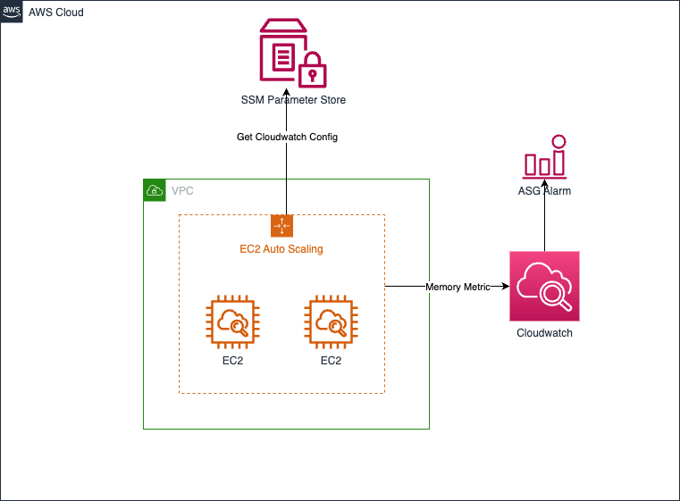
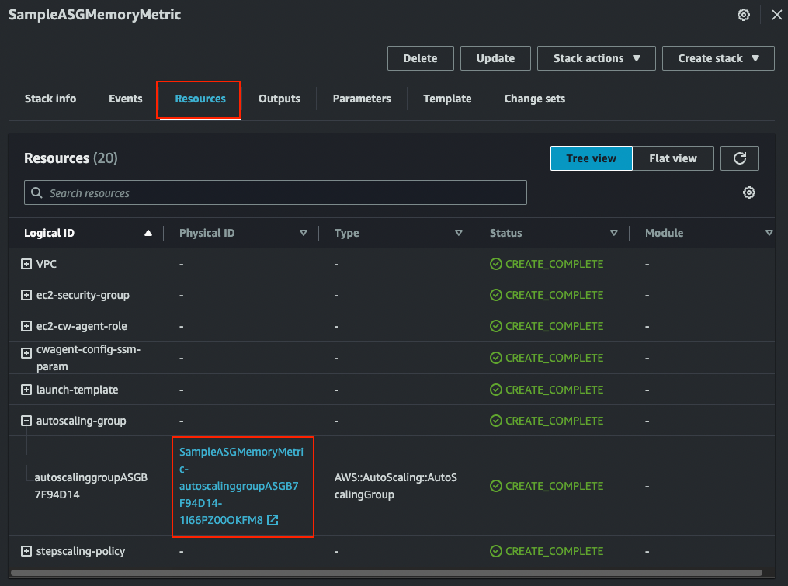
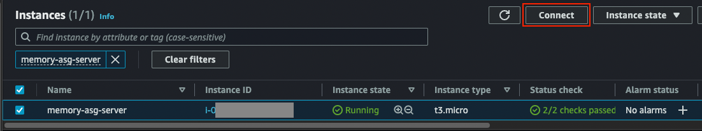
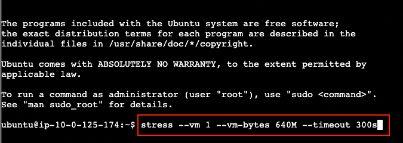
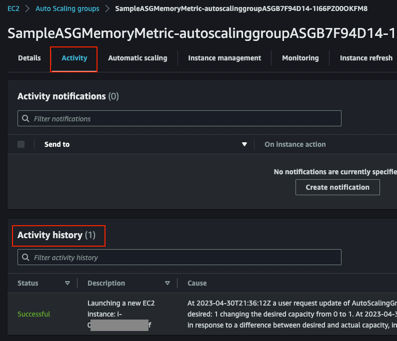

# Autoscaling Group with custom Memory metric

This example deploys an Autoscaling Group with Cloudwatch agent configuration which sends memory metric to Cloudwatch. It picks up Cloudwatch agent configuration from SSM Parameter Store. It includes `stress` tool to simulate autoscaling action when memory is under load.

This example will deploy:
- a new VPC with 2 AZs and 2 public subnets
- a Security Group and IAM role
- a SSM parameter
- a Launch Template
- an Autoscaling Group with custom Step Scaling Policy
- Cloudwatch custom metric

## Architecture

This is the architecture for EC2 Autoscaling Group with memory metric



## Instructions

1. Deploy the sample using either CDK or Cloudformation.
2. Both method generates a Cloudformation stack. Check out the deployed autoscaling group in Cloudformation console.
3. Connect to one of the instance in Autoscaling Group using EC2 Instance Connect.
4. Run `stress` command to generate load to memory
5. Watch autoscaling event under Autoscaling Group's Activity tab.

### 1a. Using CDK
1. Ensure CDK is installed and bootstrapped (run `cdk bootstrap` to bootstrap CDK).
2. Deploy the CDK code using `cdk deploy` from cdk root directory ie. `./src/cdk/`

### 1b. Using Cloudformation
1. Simply deploy the Cloudformation template in `./src/cfn/sample-asg-memory-metric-template.yaml`. Complete instruction on how to deploy Cloudformation template in Cloudformation console can be found [here](https://docs.aws.amazon.com/AWSCloudFormation/latest/UserGuide/cfn-console-create-stack.html)

### 2. Check out the Instance ID
1. Autoscaling Group resource is available under Resources tab in the generated Cloudformation stack.
    

### 3. Connect using Instance Connect
1. Check out one of the Autoscaling Group's instance in EC2 console
2. Connect using EC2 Instance Connect
    

### 4. Run command to generate load to memory
1. Run command
   ```
   stress --vm 1 --vm-bytes 640M --timeout 300s
   ```
    

### 5. Watch autoscaling event under Autoscaling Group's Activity tab
1. Alarm and autoscaling action will be triggered after memory exceeds 30% for 3 consecutive time.
2. If the alarm and autoscaling action are not triggered, re-run the `stress` command
3. Monitor under Activity tab <br />
    
