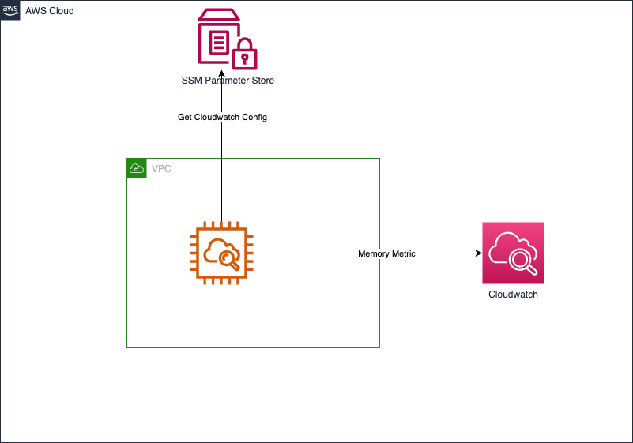
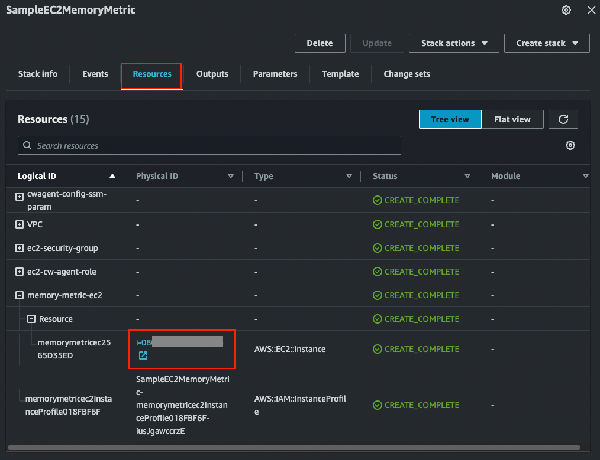
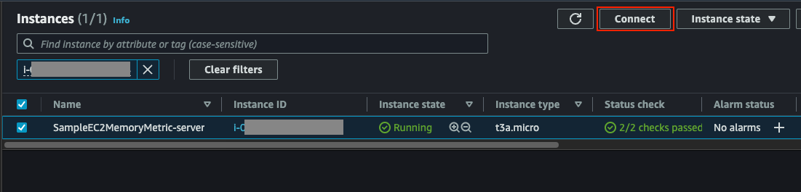
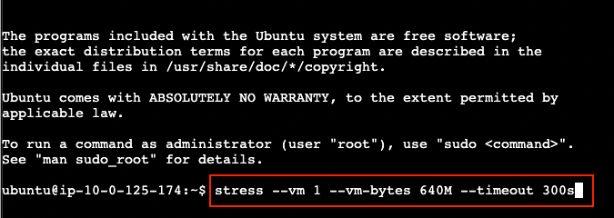

# EC2 Instance with custom Memory metric

This example deploys an EC2 with Cloudwatch agent configuration which sends memory metric to Cloudwatch. It picks up Cloudwatch agent configuration from SSM Parameter Store. It includes `stress` tool to simulate pressure to memory. You can see the the memory metric spikes in Cloudwatch metric.

This example will deploy:
- a new VPC with 2 AZs and 2 public subnets
- a Security Group and IAM role. Security group is allowing port 22 from any IPv4 for EC2 Instance Connect access
- an SSM parameter
- an EC2 Instance
- Cloudwatch custom metric

## Architecture

This is the architecture for single instance EC2 with memory metric



## Instructions

1. Deploy the sample using either CDK or Cloudformation
2. Both method generates a Cloudformation stack. Check out the deployed instance ID in Cloudformation console.
3. Connect to the instance using EC2 Instance Connect
4. Run `stress` command to generate load to memory

### 1a. Using CDK
1. Ensure CDK is installed and bootstrapped (run `cdk bootstrap` to bootstrap CDK).
2. Deploy the CDK code using `cdk deploy` from cdk root directory ie. `./src/cdk/`

### 1b. Using Cloudformation
1. Simply deploy the Cloudformation template in `./src/cfn/sample-ec2-memory-metric-template.yaml`. Complete instruction on how to deploy Cloudformation template in Cloudformation console can be found [here](https://docs.aws.amazon.com/AWSCloudFormation/latest/UserGuide/cfn-console-create-stack.html)

### 2. Check out the Instance ID
1. Instance ID is available under Resources tab in the generated Cloudformation stack.
    

### 3. Connect using Instance Connect
1. Check out the particular instance ID in EC2 console
2. Connect using EC2 Instance Connect
    

### 4. Run command to generate load to memory
1. Run command
   ```
   stress --vm 1 --vm-bytes 640M --timeout 300s
   ```
    
